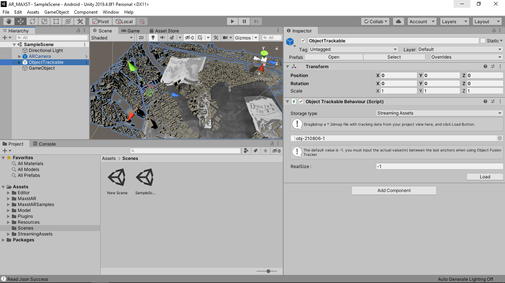

# ARApplication
 
AR application helps visualize the project's model content

# Getting Started

## Steps to use the project

1. Download [Visual SLAM Tool](https://developer.maxst.com/MD/download/vslam) software.
2. Use Visual SLAM Tool software to design and create 3D object maps (0.3m - 1.5m) or the environment.
3. Save and import to Unity
4. Open scene SampleScene.
5. Click on ObjectTrackable, at ObjectTrackableBehaviour select the 3dmap file just created from Visual SLAM Tool.
6. Now proceed to edit the object to match the map.


 
## Package Installation

### Prerequisites

```
Unity 2019.4.x
Visual studio 2019
```
